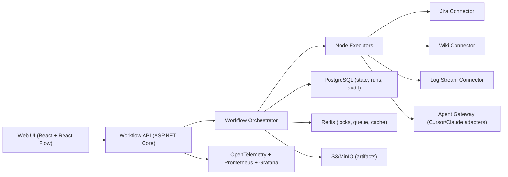

# Workflow Server Architecture (deterministic-first)

## 1) Цель

Собрать web-платформу, где пользователь конструирует workflow в виде графа (node-based), а сервер исполняет его детерминированно.  
LLM не является обязательным слоем: агент (Cursor/Claude Code API) подключается как отдельный шаг `AgentTask`.

## 2) Принципы

1. **Deterministic-first**: максимум шагов выполняется без модели.
2. **Model-last**: агентный вызов только в явных узлах, под budget/policy.
3. **Reproducible runs**: одинаковый вход = одинаковый путь выполнения.
4. **Audit by default**: полный трейс run, входов, решений и артефактов.
5. **Provider-agnostic**: Cursor/Claude/другие через единый adapter contract.

## 3) Верхнеуровневая схема

## 4) Компоненты

### 4.1 Web UI
- Визуальный редактор DAG.
- Версионирование workflow.
- Просмотр run timeline и логов по нодам.
- Запуск manual run / scheduled run.

### 4.2 Workflow API
- CRUD для workflow definitions.
- Валидация графа (циклы, типы входов/выходов, policy).
- Start/stop/retry run.
- Выдача run diagnostics в UI.

### 4.2.1 Trigger model (обязательно)
- `ManualTrigger` — запуск из UI/API пользователем.
- `ExternalSignalTrigger` — запуск по webhook/event из внешних систем (alerts, Jira, CI/CD, etc.).
- `ScheduledTrigger` — cron/расписание.
- `ReplayTrigger` — запуск из checkpoint для отладки/rehydration.

### 4.3 Orchestrator
- Планирует execution order по DAG.
- Управляет состояниями run/node:
  - `Pending -> Running -> Succeeded | Failed | Skipped`.
- Обеспечивает retry policy, timeout, idempotency.
- Пишет event-sourcing trail.

### 4.4 Node Executors (первый набор)
- `JiraCollectInfo`
- `CollectLogsFromStream`
- `ReadWikiDocs`
- `MergeContext`
- `BuildEvidencePack`
- `AgentTask` (внешний агент по API)
- `QualityGate`
- `PublishResult`

### 4.5 Agent Gateway
- Единый интерфейс:
  - `CreateTaskAsync`
  - `GetTaskStatusAsync`
  - `GetTaskResultAsync`
- Адаптеры:
  - `CursorAgentAdapter`
  - `ClaudeCodeAdapter`
- Cross-cutting:
  - токены/секреты,
  - бюджет,
  - rate-limit,
  - circuit breaker.

## 5) Модель данных (минимум)

- `workflow_definitions` (id, name, version, json_graph, created_by, created_at)
- `workflow_runs` (run_id, workflow_id, version, trigger_type, started_at, ended_at, status)
- `node_runs` (run_id, node_id, started_at, ended_at, status, retries, error)
- `run_events` (event_id, run_id, ts, level, event_type, payload_json)
- `artifacts` (artifact_id, run_id, node_id, type, uri, checksum, size)
- `secrets_ref` (integration_key, vault_ref)

## 6) Контракт execution context

Каждый node получает:
- `RunContext` (runId, workflowVersion, actor, policy, deadlines)
- `NodeInput` (результаты upstream-нод)
- `WorkingSet` (временные промежуточные данные)

И возвращает:
- `NodeOutput` (typed payload + artifact refs + metrics)

## 6.1 Контракт запуска run

`StartRunRequest`:
- `workflow_id`
- `workflow_version` (опционально; если не задано — active version)
- `trigger_type` (`manual|external_signal|scheduled|replay`)
- `trigger_payload` (json)
- `idempotency_key` (обязательно для external_signal)
- `requested_by` (user/service principal)
- `checkpoint_id` (для replay)

`StartRunResponse`:
- `run_id`
- `status`
- `accepted_at`

Правила:
- одинаковый `idempotency_key` + `workflow_id` в suppression window не должны создавать новый run;
- `external_signal` может быть принят async (202 Accepted), обработка через очередь;
- `manual` может быть sync-accept из UI с немедленным отображением timeline.

## 7) Политики и guardrails

- **BudgetPolicy**: max agent calls/run, max tokens/run, max runtime/run.
- **DataPolicy**: маскирование PII/секретов перед AgentTask.
- **ApprovalPolicy**: чувствительные шаги требуют human approval.
- **FallbackPolicy**: при ошибке агента используем deterministic fallback path.

## 8) Наблюдаемость

- OpenTelemetry traces: `run -> node -> connector/agent`.
- Метрики:
  - run success rate,
  - node p95 latency,
  - agent error rate,
  - token/cost per run (если применимо),
  - cache hit ratio.
- Structured logs с `run_id`, `node_id`, `workflow_version`.

## 9) Деплой (корп-сервер)

- Backend: ASP.NET Core в Docker.
- UI: static frontend (Nginx или CDN/internal ingress).
- Storage: PostgreSQL + Redis + S3/MinIO.
- Auth: SSO (OIDC/SAML) + RBAC.
- Secrets: Vault/K8s Secrets.
- K8s: отдельные deploy для `api`, `worker`, `scheduler`.

## 10) Roadmap (реалистичный)

### Phase 1 (MVP)
- Редактор графа + 4 deterministic node.
- Запуск run и просмотр timeline.
- `AgentTask` только через 1 адаптер (например Cursor).

### Phase 2
- Versioned publishing workflow.
- Scheduling + retries + dead-letter runs.
- Quality gates и approval steps.

### Phase 3
- Multi-agent adapters.
- Reusable subflows и template library.
- Cost optimizer + policy simulator.

## 11) Почему MAF здесь опционален

Для ядра workflow runtime MAF не обязателен.  
MAF имеет смысл как внутренняя реализация `AgentTask` (если потребуется tool-calling/memory/multi-step agent behavior).  
Базовая платформа должна оставаться независимой от конкретного agent framework.
