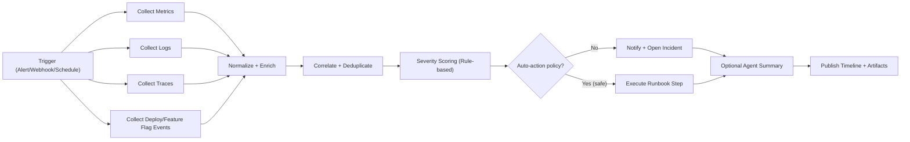

# Production Monitoring as Workflow (deterministic-first)

## 1) Цель

Сделать автоматический мониторинг прода как набор workflow-графов:
- быстро обнаруживать инциденты,
- автоматически собирать evidence,
- запускать стандартные действия,
- минимально использовать модель (agent-step только там, где реально нужна).

## 2) Основной принцип

1. Detection, correlation, routing и первичные действия — **без модели**.
2. Agent-step включается только для:
   - человекочитаемого summary,
   - гипотез root cause,
   - черновика postmortem.
3. Любые рискованные действия (rollback, feature kill) — только через policy/approval.

## 3) Канонический граф инцидента

## 4) Ноды (MVP)

1. `TriggerAlert`  
   Вход: webhook от Prometheus Alertmanager / Sentry / Datadog.
   Также должен поддерживать ручной `ManualTrigger` из UI (например, "переоценить инцидент").

2. `CollectMetrics`  
   Чтение последних N минут KPI/SLI метрик.

3. `CollectLogs`  
   Выгрузка ошибок по service/env/release.

4. `CollectTraces`  
   p95/p99, error span signatures.

5. `CollectReleaseContext`  
   Последние деплои, feature flags, config changes.

6. `NormalizeEvidence`  
   Приведение данных к единому контракту.

7. `DeduplicateIncident`  
   Fingerprint + suppression window.

8. `SeverityScore`  
   Rule-based scoring (P1/P2/P3).

9. `RunbookAction`  
   Безопасные автоматические шаги (например, перезапуск consumer, scale up).

10. `NotifyIncident`  
    PagerDuty/Slack/Telegram/Jira.

11. `AgentSummary` (optional, gated)  
    Формирует короткий digest для on-call.

12. `PersistIncidentArtifacts`  
    Сохраняет timeline, evidence pack, decisions.

## 5) Контракт evidence pack

`IncidentEvidencePack`:
- `incident_id`
- `trigger`
- `service`, `env`, `region`, `tenant`
- `time_window`
- `sli_snapshot` (availability, latency, error rate)
- `top_errors` (logs)
- `top_failed_spans` (traces)
- `recent_changes` (deploy/flags/config)
- `candidate_causes` (только детерминированные на этом этапе)
- `actions_taken`

Это основной payload между нодами и вход для agent-step.

## 6) Вариант для game production (Playtika / Solitaire Grand Harvest)

Отдельный профиль сигналов:
- backend/API errors,
- payment/receipt validation errors,
- matchmaking/session drops,
- economy anomalies (ARPDAU spike/drop, sink/source imbalance),
- ad mediation fill-rate/cpm падение,
- push delivery degradation.

Специальные ноды:
- `CollectEconomyKPIs`
- `CollectAdMediationKPIs`
- `DetectEconomyAnomaly` (rule-based пороги + baseline)

## 7) Policy и безопасность

### Auto-actions allowlist
- Разрешено автоматически:
  - создать incident ticket,
  - уведомить каналы,
  - запустить read-only диагностику.
- Требует approval:
  - rollback deployment,
  - disable feature flag,
  - throttle/ban traffic.

### Data policy
- PII redaction до передачи в agent-step.
- Логи с токенами/секретами в агент не отправлять.

## 8) Checkpoints и resume

Checkpoint ставим:
1. после `NormalizeEvidence`,
2. после `SeverityScore`,
3. после `RunbookAction`/`NotifyIncident`.

Это дает:
- восстановление после падения worker,
- повтор обработки без дублирования,
- branch “what-if” от checkpoint (например, другой runbook).

## 9) SLA самого workflow

- `Detection to first signal`: <= 60s
- `Detection to enriched evidence`: <= 2 min
- `Detection to routed incident`: <= 3 min
- `False positive rate`: отслеживать отдельно

## 10) Экономия на моделях

По умолчанию `AgentSummary` выключен.

Включать только если:
- Severity >= P2,
- evidence pack неполный/противоречивый,
- нужен человекочитаемый executive digest.

Лимиты:
- max 1 agent-call на incident в MVP,
- strict timeout (например 15s),
- fallback: deterministic template summary.

## 11) Roadmap

### Phase 1
- Alert -> evidence -> severity -> notify (полностью deterministic).
- Единый trigger слой: manual + external webhook/event.

### Phase 2
- Safe runbook automation + checkpoint/resume + dedup quality tuning.

### Phase 3
- Optional agent reasoning for difficult cases + postmortem draft generation.
